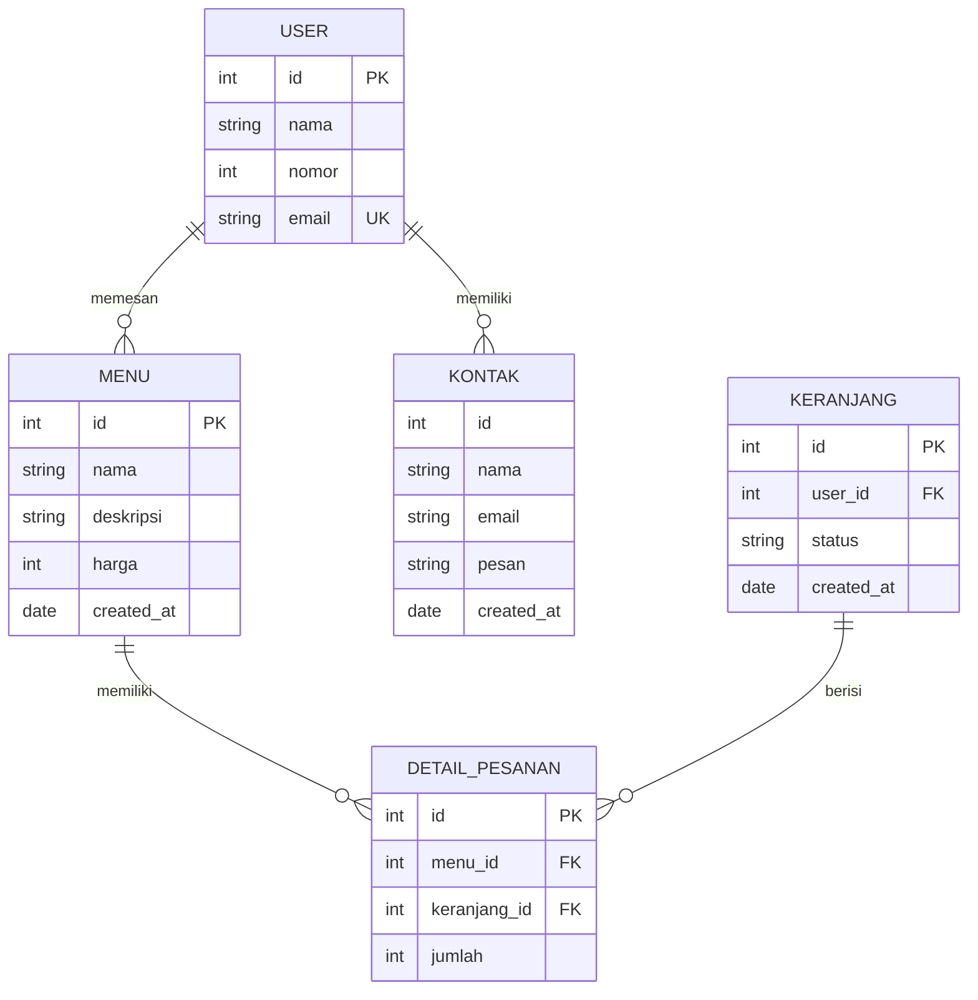

# ERD KairnPizza

```mermaid
erDiagram
    USER ||--O{ MENU: "memesan"
    USER ||--O{ KONTAK: "memiliki"
    MENU ||--O{ DETAIL_PESANAN: "memiliki"
    KERANJANG ||--O{ DETAIL_PESANAN: "berisi"

    USER {
        int id PK
        string nama
        int nomor
        string email UK
    }

    MENU {
        int id PK
        string nama
        string deskripsi
        int harga
        date created_at
    }

    KERANJANG {
        int id PK
        int user_id FK
        string status
        date created_at
    }

    DETAIL_PESANAN {
        int id PK
        int menu_id FK
        int keranjang_id FK
        int jumlah
    }

    KONTAK {
        int id
        string nama
        string email
        string pesan
        date created_at
    }


```